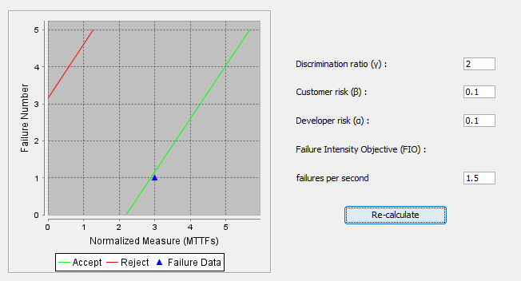
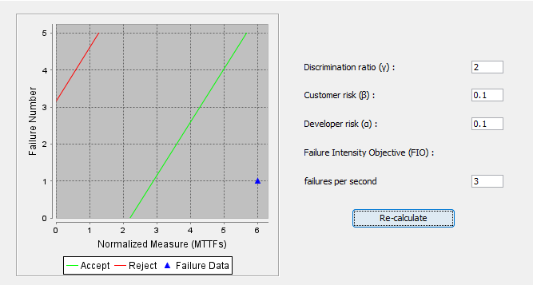
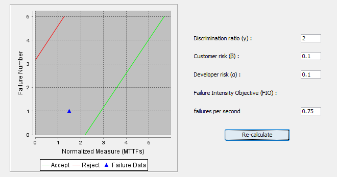

**SENG 438- Software Testing, Reliability, and Quality**

**Lab. Report \#5 – Software Reliability Assessment**

| Group \#:      | 04          |
| -------------- | ----------- |
| Student Names: | Azlan Amjad |
|                | Saud Agha   |
|                | Rohan Amjad |
|                | Sajid Hafiz |

# Introduction

This lab includes an analysis of integration test data using reliability assessment tools. In this lab we will use two ways to assess the failure data, **Reliability Growth Testing** and **Reliability Demonstration Chart**. The purpose of this lab is to get hands on experience with reliability assessment of a hypothetical system given failure data collected from integration testing. In the first part of this lab we will install a reliablity growth assessment tool and create plots for failure rate and reliability.

#

# Assessment Using Reliability Growth Testing

## Result of Model Comparison

## Result of Range Analysis

## Plots For Failure Rate and Reliability

## Discussion on Decision Making Given a Target Failure Rate

## Advantage and Disadvantages

# Assessment Using Reliability Demonstration Chart

## 3 Plots For MTTFmin

Minumum MTTF:

Twice MTTFmin: 

Half MTTFmin: 

## Evaluation and Justification of MTTFmin

To calculate minimum Mean Time Between Failures (MTTF), we used a "brute-force" approach, by playing around with the Failure Intensity Objective (FIO) inputs
on the SRTAT Reliability Demo Chart tool. This method might not have been the best, but due to the vagueness of data provided, and to avoid mis-identifying the data set, we decided to use observations as the guiding force. We evaluted that due to simplistic nature of Reliability Demo Chart, it is easy to get a "glance" of the reliabilty surrounding a system, but it lacks a more quantitative aspect which might help determine exact cause-effects around reliability. 

## Advantages and Disadvantages

An advantage we found when using the SRTAT Reliability Demo Chart Tool was the ease of setting everything up and modelling the data. However, a disadvantage was finding "exact values" or any information which might help us quanitfy the model in real-world terms. 

#

# Comparison of Results

The calculated target failure rate from Part One (0.60) would not fit in the "accept" range on the Reliability Demonstartion Chart from Part Two. One way to allow the calculations from Part One to "fit" in our RDC, we can increase the customer risk. However, we are increasing the risk of assessing entities which are wrong to be right, and in the real world this can have dire consequences. Another method is to increase the discrimination ratio, this is the risk related to measured entity itself.

# Discussion on Similarity and Differences of the Two Techniques

Both tools allow to see software quality in a more qualitiative light. However, one major difference is that one tool (C-SFRAT) is focused heavily on reliability growth assessment, while SRAT has potential to do both reliability growth assessment and Reliability Demonstration Chart. One thing to note, is while SRAT can do both of the parts in the lab, we decided to use a mixture of C-SFRAT and SRAT to gain wider understanding of the different toolsets.

# How the team work/effort was divided and managed

#

# Difficulties encountered, challenges overcome, and lessons learned

# Comments/feedback on the lab itself
